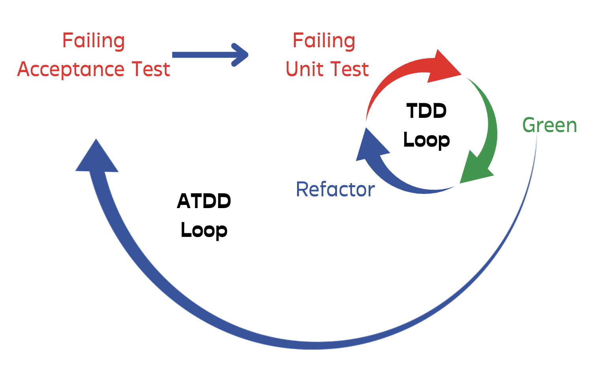

# Bank account - Outside-In kata

## Objectives
Think of your personal bank account experience
When in doubt, go for the simplest solution

## Problem Description
Create a simple bank application with the following features :
- Deposit into Account
- Withdraw from an account
- Print a bank statement to the console

### Starting points and Constraints
1. Start with a class following this structure:
````scala
class AccountService {
  def deposit(customerId: UUID, amount: Double): Either[String, Account]
  def withdraw(customerId: UUID, amount: Double): Either[String, Account] 
  def printStatement(customerId: UUID, printer: String => Unit): Unit
}
````
> Account must stay immutable

2. You are not allowed to add any other `public` method
3. Use `String` and `Double` for dates and amounts (keep it simple)

### Scenario
Here is an acceptance scenario as described by one of our Domain Expert

```gherkin
Scenario: Printing statement after deposits and withdrawal
  Given a client makes a deposit of 1000 on 12-08-2022
  And a deposit of 2000 on 18-08-2012
  And a withdrawal of 500 on 19-01-2012
  When he/she prints her bank statement
  Then he/she would see
  """
  date       |   credit |    debit |  balance
  19-01-2022 |          |   500.00 |  2500.00
  18-01-2022 |  2000.00 |          |  3000.00
  12-01-2022 |  1000.00 |          |  1000.00
  """
```

## Outside-In TDD



