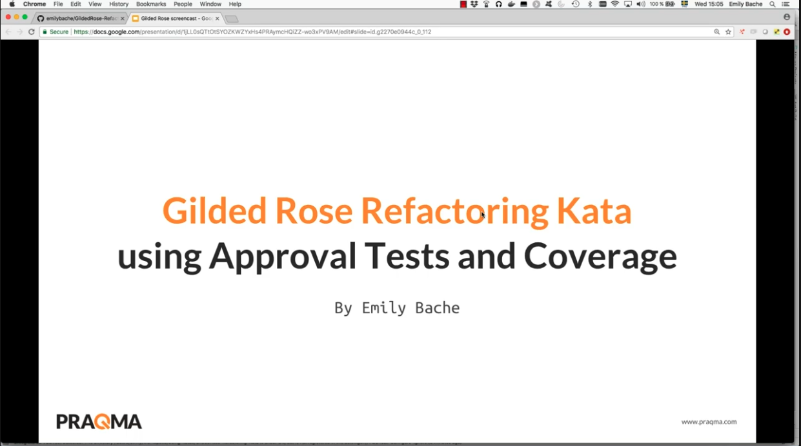

# Gilded Rose Kata
> Challenge for today : prepare a refactoring on the GildedRose class

This Kata was originally created by Terry Hughes (http://twitter.com/TerryHughes). 

It is already on GitHub [here](https://github.com/NotMyself/GildedRose). See also [Bobby Johnson's description of the kata](http://iamnotmyself.com/2011/02/13/refactor-this-the-gilded-rose-kata/).

## Learning Objectives
- Learn a practice that will help you be quickly productive in an unfamiliar environment
- Use `Approval Testing` to deal with legacy code

## Connection - Web hunt
In pair, take a look on the internet and find an answer to this question:
`What is approval testing?`
 

## Concepts
### What is Approval Testing ?
Approval Tests also called `Snapshot Tests` or `Golden Master`
- Work by creating an output that needs `human approval / verification`

Once the initial output has been defined and `APPROVED` then as long as the test provides consistent output then the test will continue to pass.

> Compare your implementation/actual program against approved outputs

Once the test provides output that is different to the approved output the test will fail. 

### The difference with Assert-based tests
- Unit testing asserts can be difficult to use
- Approval tests simplify this by taking a snapshot of the results
  - Confirming that they have not changed

## Step-by-Step

## What did we use / learn ?

## Sources 
- [Approval Tests](https://approvaltests.com/)  

