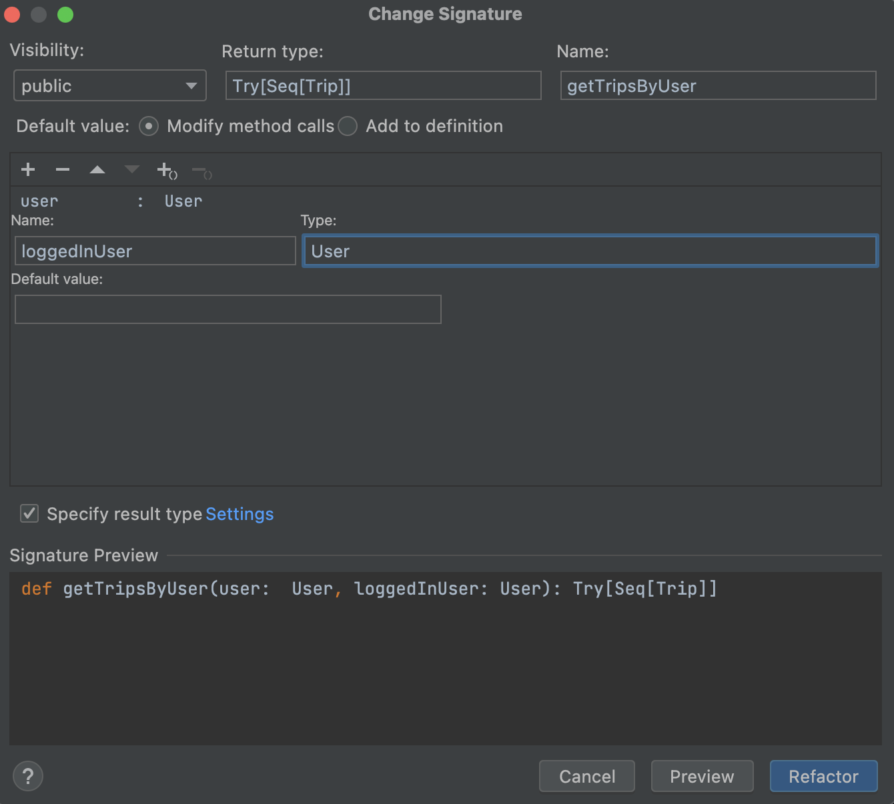

# Trip Service Kata
> Challenge for today : refactor the `TripService` class to ensure Clean Code / SOLID principles

The end result should be well-crafted code that express the domain.


- Legacy code golden rule :
`You cannot change any existing code if not covered by tests.`
  - The only exception is if we need to change the code to add unit tests, but in this case, just automated refactorings (via IDE) are allowed.
- Step-by-step solution available [here](solution/step-by-step.md)

## Step-by-Step
## Tips
- Start testing from shortest to deepest branch
- Start refactoring from deepest to shortest branch


## Cover our code
- Identify code smells in the `TripService` class
- Write a first test : do it "naively"
  - Which one would you write first ?
  - What problem occurs ?

> How could we make the production code testable ?

### Seams
- Adding tests on the existing code can be challenging
- The code was not written to be testable in the first place
- 99% of the time, this is a dependency problem
- 	The code you want to test can’t run
	- It needs something hard to put in the test :
		- A database connection 
		- A third-party server
		- A parameter that’s complex to instantiate
	- Usually, it’s a complex mix of all that.

> To test your code, you need to break these dependencies in the tests.

Therefore, you need to identify `Seams`.

`A Seam is a place to alter program behavior, without changing the code.`

There are different types of Seams. 
The gist of it is to identify how you can change the code behavior without touching the source code.

If your language is Object-Oriented, the most common and convenient Seam is an object.

Consider this piece of JavaScript code :

```javascript
export class DatabaseConnector {
  // A lot of code…

  connect() {
    // Perform some calls to connect to the DB.
  }
}
```

Say the connect() method is causing you problems when you try to put code into tests. Well, the `whole class is a Seam you can alter`.

You can extend this class in tests to prevent it from connecting to an actual DB:

```javascript
class FakeDatabaseConnector extends DatabaseConnector {
  connect() {
    // Override the problematic calls to the DB
    console.log("Connect to the DB")
  }
}
```

### Isolate the Singleton dependencies
- Isolate the Singleton dependencies in their own method

```scala
UserSession getLoggedUser()
TripDAO.findTripsByUser(user)
```
- Do it via automated `extract method` automated refactoring

### Refactor our first test
- In our test class, we can now extend the `TripService` class
- We can now override the `private` to `protected` methods we created making them return whatever we need for our unit tests
- Refactor the test to use the `TripService` for tests class

### Coverage as a Driver
- Run your favorite `code coverage` tool
- Use the result as a driver for implementing/writing new tests

- `From shortest to deepest branch`, what is our next test to write ?
- Think about FIRST principles :
  - We have introduced a strong dependency between our tests through the `loggedUser`
  - We must ensure to respect FIRST principle
    - `Fast` : Tests should be fast enough that you won't be discouraged from using them
    - `Isolated` : Tests should not depend on the state of another test
    - `Repeatable` : Tests should be repeatable in any environment without varying results
    - `Self validating` : Each test will have a single boolean output of pass or fail
    - `Thorough` : The tests we write should cover all happy paths/edge/corner/boundary cases
- Let's isolate our tests :
    - With `scalatest` we can use the trait `BeforeAndAfterEach` to set up our tests
- Be careful on the test quality
  -  The user on which we ask for trips does not contain any trips nor any friends...
  - `we can not be sure our feature is implemented well` if we have wrong setups
- Avoid having not named values like `null` or `new Trip()` in your tests
  - Give sense to those by naming them
- Let's cover the `happy path`

### What can be improved ?
- Duplications in our tests ?
  - And some test setups already require some cognitive resources to understand what is going on :
```scala
val aUserWithTrips = new User()
aUserWithTrips.addTrip(toPortugal)
aUserWithTrips.addTrip(toSpringfield)
aUserWithTrips.addFriend(anotherUser)
aUserWithTrips.addFriend(loggedInUser)
```
- Let's use [Test Data Builders](http://www.natpryce.com/articles/000714.html) to improve it
  - It helps to hide / encapsulate / centralize the creation of your objects
    - Make it more flexible if your design change
  - Make your tests more readable and more business oriented
- Define your builder from your IDE
  - Type directly in your test how you want to use your `Builder` 
- Let our IDE generates the code for us
- Improve the builder with a Higher Order Function that avoid duplication
    - `return this` duplication
- Use it in all of our tests

> We are now ready to refactor

## Refactoring
- Start refactoring from deepest to shortest branch

### [Feature Envy](http://wiki.c2.com/?FeatureEnvySmell)
```scala
breakable {
    for (friend <- user.friends()) {
      if (friend == loggedInUser) {
        isFriend = true
        break
      }
    }
}
```

- A common code smell
- When a class gets data from another class in order to do some calculation or comparison on that data
  - it means that the client class envies the other class
  - In OO, data and the operations on that data should be on the same object

> The whole point of objects is that they are a technique to package data with the processes used on that data. A classic smell is a method that seems more interested in a class other than the one it is in. The most common focus of the envy is the data.

- Let's fix it by using TDD (Test Driven Development)

- Implement a new behavior on `User` : `isFriendWith`
  - By starting with a test : `"User" should "inform when users are friends" in {`
- Add a second test case : the passing one
- We can now use it in our `TripService`
  - Run your tests at any change in your production code
- Simplify the code

### Guard clause
- Move the guard clause at the beginning of the method to reduce complexity
```scala
  def getTripsByUser(user: User): List[Trip] = {
    val loggedInUser = getLoggedUser
    if (loggedInUser == null) {
      throw new UserNotLoggedInException
    }

    var tripList: List[Trip] = List()
    if (user.isFriendWith(loggedInUser)) {
      tripList = findTripsByUser(user).toList
    }
    tripList
  }
```

### Simplify the code
- We want to remove the `var tripList` now
- Use a business term for `List.empty`
- Extract a method for the guard as well

### Be transparent in your contracts
- For this kind of guard we should favor continuation
  - If we do so we should change the return type of our method as well to represent the computation issue that could be raised
  - In other terms we should use a monad
  - Our methods should be as explicit as possible
- Refactor the code to use a `Try`

- We have changed the public contract of the class
  - We must adapt our tests
  - Use `TryValues` trait to simplify assertions

### Make the implicit explicit
- We can now attack our dependency issues

#### LoggedInUser
- Break the internal dependency by injecting the `loggedInUser` in our method
- Let's use our IDE for that -> `Change signature...` 
  - `⌘ + F6`

- Fix the tests by passing the `loggedInUser`
- Use the `loggedInUser` passed in method argument
- We can now remove the `getLoggedUser` method
  - Both in our production and test codes

- Clean up your tests
    - No need to set a loggedUser anymore

#### TripDAO
- We want to be able to mock the behavior of our `Data Access` layer :
    - We need an instance method to do so with `scalamock`
- First, let's write a test on the implemented behavior of the `TripDAO`
- Now let's change our test and create our code from it
  - Something like this `new TripDAO().findTripsBy(UserBuilder.aUser().build())`
- Implement the `TripDAO` method
  - How to do that 🤔
- We can now work from our `TripServiceSpec` to inject this dependency
  - Use the `Change Signature` refactoring tool for that
  - Clean the tests
    - Remove the `createTripService` method
- Use the new dependency in our Service
- Run the tests
  - We should receive an error because we have not configured the `TripDAO` stub

- Setup our stub

## Surface refactoring
What can be improved ?

## What did we use / learn ?
- Seams
- Automated refactoring via our IDE
  - Extract Method
  - Change Signature
  - Rename
- Use code coverage as a driver
- Test Data Builder
- Feature Envy
- TDD

## Sources 
- [Original kata](https://github.com/sandromancuso/trip-service-kata/)
- [Sandro Mancuso - Testing legacy with Hard-wired dependencies](https://www.codurance.com/publications/2011/07/16/testing-legacy-hard-wired-dependencies)
- [Nicolas Carlo - understand legacy code](https://understandlegacycode.com/blog/key-points-of-working-effectively-with-legacy-code/#identify-seams-to-break-your-code-dependencies)
- [Micheal Feathers - Working Effectively with Legacy Code](https://www.oreilly.com/library/view/working-effectively-with/0131177052/)

<a href="https://youtu.be/LSqbXorkyfQ" rel="Sandro's video"></a>